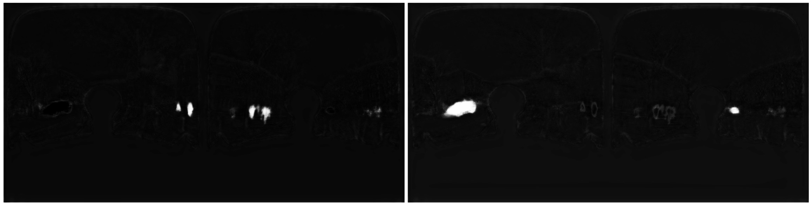
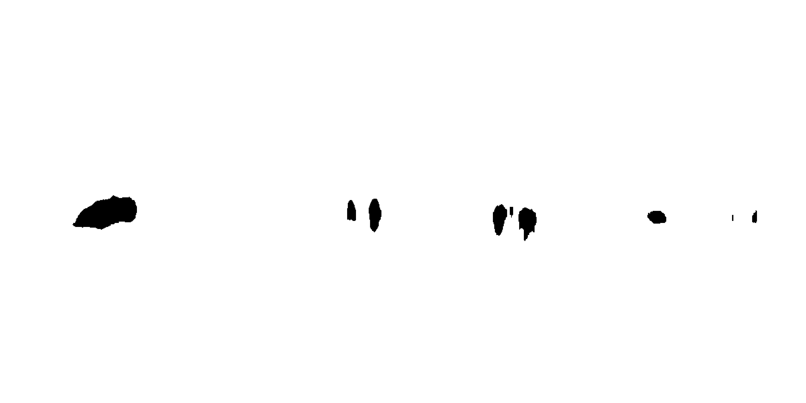
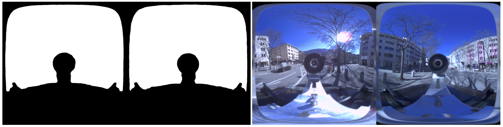

# scanvan-image-processing

Image anonymization tool for the ScanVan project. People and cars are blurred on panoramic images of the city of Sion, in order to be published on [website of the project](https://scanvan.dhlab.epfl.ch/) in compliance with the legal requirements for protection of personnal data.

This image processing pipeline is compatible with 3D reconstruction made with [openMVG](https://github.com/openMVG/openMVG).

### Architecture

```
main-folder
│   
└───images (jpg or png format required)
│   
└───anonymization (created at step 1.)
│       │
│       └──segmentation (step 1.)
│       │
│       └──masks (step 2.)
│       │
│       └──blur (step 3.)
│       │
│       └──gaussian_blur (step 4.)
│
└───omvg outputs
    │
    └───sfm_data.bin
    │
    └───sfm_data_bin.json (cf. note below)
    
```

Note : *sfm_data.bin* must be converted to *sfm_data_bin.json* using *openMVG_main_ConvertSfMDataFormat -i sfm_data.bin -o sfm_data_bin.json* from [openMVG](https://github.com/openMVG/openMVG).

### 1. image segmentation

A segmentation model has been trained to detect people and vehicles. It has been trained using [dhSegment](https://dhsegment.readthedocs.io/en/latest/), the weights and training set are available [here](INSERT LINK).

```
python segmentation_2d.py --model_dir <path-to-dhsegment-model-weights>
                                      --export_dir <path-to-main-folder>
```

*probability maps of detection of people (left) and vehicles (right)*

### 2. create masks from the segmentation results

Masks are made from the probability maps, for each image.

```
python custom_masks.py --folder <path-to-main-folder>
                       
```


### 3. Blur images

Images are blurred with their corresponding mask.
The blurring is done using a [missing pixel extrapolation](https://github.com/nils-hamel/image-suite/tree/master/src/image-missing-pixel).
The *DST* folder has to be created before starting the blurring process.
```
./scanvan_mask $SRC $MASKS $DST

```


### 4. Blur camera (optional)

For aesthetical reasons, a slight blur is applied on all the images to cover the camera and car roof.



*Left : mask covering the motionless car roof and camera, right : image with gaussian blur.*

### 5. Website reporting tool

A reporting tool is available to the public on the website to notify personnal data which must be blurred and were not detected at step 1. The annotations are checked and the images' masks are updated accordingly on a weekly basis. The process is done with [website-reporting.ipynb](https://github.com/adescombes/scanvan-image-processing/website-reporting.ipynb).


                         